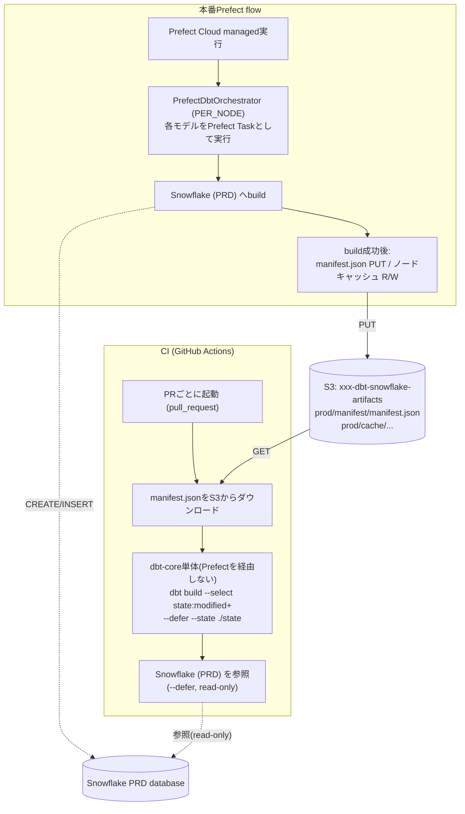

## はじめに
こんにちは、クラシルのデータチームのKOHです。

先日、[PrefectがDagsterを買収する](https://www.prefect.io/prefect-acquires-dagster)という発表がありました。Dagsterは、アセット指向という他のパイプラインとは特異な性質を持っていると思います。そういった要素が今後Prefect側にも取り込まれたりするんでしょうか...？期待がかかります。

弊社は現在分析基盤内のデータパイプラインを構築しておりますが、一気通貫で取り込み処理から加工処理までを行うためのオーケストレーションツールは導入しておりません。
そのため、途中エラーの際には、順番を考えて再実行するなど、非常に苦労を強いられています。

そこで、オーケストレーションツールの候補の1つとして、PrefectをPoCレベルで検証してみました。
触ってみると意外と、dbtとの連携や、フローのリトライの時の動きなど学びがあったので、今後のためにもメモとして残しておこうと思います。


1. `PrefectDbtOrchestrator`によるモデル単位の実行状況の可視化
2. S3をバックエンドにしたノード単位キャッシュによる、変更の無いモデルの実行スキップ
3. `manifest.json`をS3に永続化し、CIでは変更モデルだけを実行するSlim CI

### 実行環境

本番flowの実行基盤はPrefect Cloudの無料プラン(managed work pool)です。パッケージバージョンは以下の通り(2026年7月時点)。

| パッケージ | バージョン |
| --- | --- |
| dbt-core | 1.11.12 |
| dbt-snowflake | 1.11.6 |
| prefect | 3.7.8 |
| prefect-dbt | 0.7.25 |
| prefect-aws | 0.7.9 |

## 全体構成



PoCで使用しているflowについては、後述するPrefectDbtOrchestratorを使って、dbt buildを実行するのみです。
勿論、本番で使用していこうとするなら、dbt buildの前に、データの抽出処理なども入ってくる想定です。

## 1. PrefectDbtOrchestratorでモデル単位の可視化

最初は`prefect-dbt`パッケージの`PrefectDbtRunner`を使っていました。これはdbt-coreの`dbtRunner`をそのまま1プロセスで呼び出す薄いラッパーです。モデルの実行順も、dbt側がコントロールします。
しかし、調べてみると、モデル単位のリトライができなかったりと、実際に使うとなると、制約がいくつか出てきそうな印象でした。

そこで、同パッケージの`PrefectDbtOrchestrator`(2026年7月現在ベータ版の`prefect_dbt.core._orchestrator`)を試してみることにしました。
こちらは`manifest.json`を自前でパースしてノードの実行順序(wave)をPrefect側が制御します。


```python
from prefect_dbt.core._orchestrator import ExecutionMode, PrefectDbtOrchestrator

orchestrator = PrefectDbtOrchestrator(
    settings=PrefectDbtSettings(
        project_dir=DBT_PROJECT_DIR,
        profiles_dir=DBT_PROJECT_DIR,
    ),
    execution_mode=ExecutionMode.PER_NODE,
)
orchestrator.run_build(target=target)
```


`PER_NODE`にすることで、Prefect UI上でモデルごとに独立したTask run(成功/失敗/実行時間)が確認できるようになり、後述のノード単位キャッシュも有効化できるようになりました。ベータ版なので、今後のアップデートでAPIが変わる可能性がある点は注意が必要です。

参考：[Comparison with PrefectDbtRunner](https://docs.prefect.io/integrations/prefect-dbt/orchestrator#comparison-with-prefectdbtrunner)

:::message
**Tips: dbt buildをサブフローに包んでPrefect UIでグルーピングする**

`PER_NODE`モードは各dbtノードを独立したTaskとして展開するため、flowにdbt build以外のタスク(ソースからのデータの抽出、エラー通知処理、他)が増えてくると、実行グラフ上で大量のdbt node taskと他のtaskが混在して見づらくなります。

対策として、`orchestrator.run_build()`を呼ぶ部分だけ別の`@flow`(サブフロー)に切り出すと、Prefect UIの実行グラフ上では「dbt build」全体が1つの折りたためるノードとしてグルーピングされ、中を展開すると従来通りモデル単位のリネージが見られます。

```python
@flow(name="dbt-build-run")
def run_dbt_build(target: str, cache: CacheConfig | None):
    orchestrator = PrefectDbtOrchestrator(
        settings=PrefectDbtSettings(
            project_dir=DBT_PROJECT_DIR,
            profiles_dir=DBT_PROJECT_DIR,
        ),
        execution_mode=ExecutionMode.PER_NODE,
        cache=cache,
    )
    orchestrator.run_build(target=target)


@flow(name="jaffle-shop-pipeline")
def dbt_build_flow(target: str = "dev"):
    ...
    run_dbt_build(target=target, cache=cache)
    ...
```

※大量のtaskをネイティブに(サブフロー化なしで)グループ表示する機能自体はPrefect本体には現時点では無いようです。
:::

## 2. S3バックエンドのノード単位キャッシュ

`PrefectDbtOrchestrator`は`cache=CacheConfig(...)`を渡すことで、内容が変わっていないノードの実行をスキップできます。これを使うと、一部のモデルだけ失敗したときに**同じflowをそのまま再実行するだけで、成功済みノードはスキップされ失敗したノード以降だけが再実行される**という、UIからの「特定モデルだけretry」に近い体験が実現できます。

```python
from datetime import timedelta
from prefect_aws import S3Bucket
from prefect_dbt.core._orchestrator import CacheConfig

cache = CacheConfig(
    result_storage=S3Bucket.load("s3-bucket-prd-cache"),
    expiration=timedelta(hours=12),
)
```


### キャッシュキーは「コードの中身」だけで決まる

キャッシュキーは以下だけのハッシュから計算されます(`prefect_dbt.core._cache.DbtNodeCachePolicy.compute_key`)。

- モデルSQL/seed CSVファイルの中身
- モデルのconfig設定
- `--full-refresh`フラグの有無
- 上流ノードのキャッシュキー(上流が変われば連鎖して変わる)
- 依存マクロファイルの中身
- 出力先のテーブル/ビュー名

つまり、**`source()`で参照する外部テーブルの行データが変わったかどうかは一切見ていません**。モデルのコードが変わっていなければ、元データが更新されていてもキャッシュがヒットしてしまい、テーブルが更新されなくなってしまうのです。例えば、日次で実行するようにしていたら、翌日分もキャッシュがヒットしてスキップされてしまいます。

その対策として、flowに設定する`expiration`をS3のライフサイクルルール(オブジェクトの自動削除、30日)より短く、日次実行の間隔(24時間)より確実に短い**12時間**に設定しました。これにより「同日中の再実行はキャッシュで高速化されるが、翌日の定期実行では必ずキャッシュが期限切れになりフルで再構築される」という動きを両立させています。

またデフォルトでは`test`・`snapshot`・`incremental`モデルはキャッシュ対象外です。特にtestはモデルのSQLが同じでも元データが変われば結果(pass/fail)が変わりうるデータ品質チェックなので、キャッシュでスキップすると壊れたデータに対して古い「pass」を信じてしまうリスクがあり、デフォルトのまま運用しています。

## 3. manifest.jsonをS3に置いてSlim CIを実現する

dbtの`state:modified`選択子と`--defer --state`フラグを使って変更モデル(とその下流)だけをビルド・テストする、いわゆる「Slim CI」にできるようにしました。
([Continuous integration in dbt](https://docs.getdbt.com/docs/deploy/continuous-integration) / [state node selector](https://docs.getdbt.com/reference/node-selection/methods#state))。

これを機能させるには、比較基準となる`manifest.json`をCIから参照できる場所に永続化しておく必要があります。Prefect Cloudのmanaged実行は使い捨てコンテナなので、明示的に永続化しないと実行終了と同時に消えてしまいます。ここが今回工夫した部分です。

### 本番flow側: build成功時にS3へPUT

```python
@task
def upload_manifest_to_s3():
    manifest_path = DBT_PROJECT_DIR / "target" / "manifest.json"
    s3_bucket = S3Bucket.load("s3-bucket-prd")
    s3_bucket.upload_from_path(manifest_path, "manifest/manifest.json")
```

`run_build()`は失敗時に例外を送出するため、このタスクは自然と「build全体が成功した時だけ」実行され、常に固定パスへ上書きすることで「最新の正しい状態」だけを保持します。

### CI側: GitHub Actions単体で完結させる

dbtモデルの変更にとどまる変更については、CIでdbt-coreで単体で動かすようなものにしてみました。

```yaml
name: Slim CI

on:
  pull_request:
    paths:
      - "jaffle_shop/**"

permissions:
  id-token: write
  contents: read

jobs:
  slim-ci:
    runs-on: ubuntu-latest
    defaults:
      run:
        working-directory: jaffle_shop
    steps:
      - uses: actions/checkout@v4
      ...
      
      - name: Download production manifest.json
        run: |
          mkdir -p state
          aws s3 cp s3://<bucket>/prod/manifest/manifest.json state/manifest.json

      ...
      - name: Run Slim CI build (changed models only)
        env:
          SNOWFLAKE_PRIVATE_KEY_B64: ${{ secrets.SNOWFLAKE_PRIVATE_KEY_B64 }}
        run: |
          export SNOWFLAKE_PRIVATE_KEY_DEV=$(echo "$SNOWFLAKE_PRIVATE_KEY_B64" | base64 --decode)
          uv run --project .. dbt build --target dev --select state:modified+ --defer --state ./state
```

こちらで、変更したモデルのみを差分で検証できます。

`dbt-state`を使えばmanifest.jsonなどの管理も不要そうですが、試してみたところ現状はdbt-core 2.0のアルファ版でしか動かず、まだ本番投入できる段階ではなさそうでした。安定版が出てきたら、こちらも検討したいと思います。

## ハマったポイント: dbtバージョンのズレでmanifest.jsonが読めなくなった

実装後、実際にPRを作ってSlim CIを検証したところ、`dbt build`が以下のエラーで失敗しました。

原因は、dbtのバージョンズレによるものです。
なぜバージョンがズレたのかというと、Prefect Cloudのmanaged実行環境(`pip_packages`)でdbt-snowflakeのバージョンを固定していなかったためでした。`pip_packages`はバージョン指定なしだと毎回pipが最新版を解決するため、`uv.lock`で固定しているローカル/CIの環境と静かにズレてしまいます。

```yaml
# prefect.yaml
job_variables:
  pip_packages:
    - dbt-snowflake==1.11.6
    - dbt-core==1.11.12
    - prefect-dbt==0.7.25
    - prefect-aws==0.7.9
```

`uv.lock`側もdbt-core 1.11系にアップグレードして揃え、`pip_packages`にも明示的にバージョンを固定することで解決しました。「manifest.jsonを生成する環境」と「それを読む環境」でdbtのバージョンを厳密に揃えておく必要がある、という教訓です。

:::message
より根本的には`uv.lock`固定の依存関係をカスタムイメージに焼き込む方法もありますが、今回使っているWork Pool type(実行基盤の種類)である`prefect:managed`はカスタムイメージ非対応で、対応するself-hosted型のWork Poolは無料プランでは使えませんでした。そのため今回は`pip_packages`のバージョン固定で対処しています。
:::

## まとめ

今回はあくまでもPoC的にオーケストレーションの導入候補としてPrefectを検証してみました。今後Prefectあるいは別のツールの導入をしてみて、気づいた点があったら再度まとめてみたいと思います！
